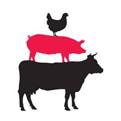

# La Noble Pie Website

## Mockups

Find a PDF of the mockups [here](laNoblePie-mockups.pdf)

## Notes

- Framework complete.
- Missing content 
    - images for "Our Story" page carousel, menu sliding box
    - employee avatar images and biographies
    - menu items and prices
    - testimonials
    - phone number

- All pages and components are responsive
- All links work and send the user to the correct information

## Issues

- Menu Navigation on manu page, buttons merge on when going up from medium sized screens
- Cannot figure a way to center align the main navbar navigation items
- Keep footer at bottom of page on contact page without fixing it at the bottom
    - fixing footer at bottom covers content on mobile and tablet views
- Sliding menu box only slides the bottom of the box (Click Menu in navbar to demo this)
- Submit button on contact page loads the submission modal even if the required form fields are left empty
- In mobile view, images in the carousel on the "Our Story" page get stretched. Not sure of a work around.

## Next Steps

- Submit to tutor and get feedback
- Present to client and get feedback

